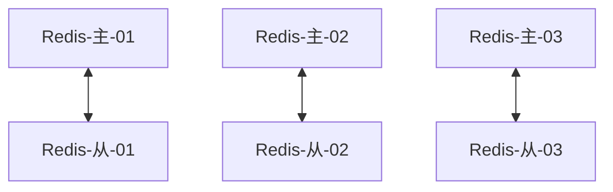

# Docker概述

## Docker为什么会出现?

环境配置的难题:开发环境,测试环境,模拟环境

开发者常常会说:它在我的机器可以跑了(It works on my machine),言下之意就是,其他机器很可能跑不了.

安装的时候,可不可以把原始环境一模一样地复制过来.

**Docker**针对上面的问题,提出了解决方案

通过隔离机制将服务器压榨到极致

## Docker的历史

2010年,几个年轻人开了家公司`dotCloud`

做一些pass的云计算技术,容器的技术

他们的技术命名为Docker

后来干不下去了...要倒闭

2013年Docker就开源了,就火了

2014年4月9日Docker1.0发布了

为什么这么火🔥?十分的轻巧!

容器技术之前,都是用的VMware虚拟机,十分笨重

Docker容器,也是一种虚拟机

> Docker是基于Go语言开发的

官网https://www.docker.com/

文档https://docs.docker.com/

仓库https://hub.docker.com/

## Docker能干啥!

- 虚拟机技术缺点:
  1. 资源占用多
  2. 冗余步骤多
  3. 启动慢

- 容器技术
  - 容器化技术模拟的不是一台完整的电脑
- Docke与虚拟机技术的不同
  - 传统虚拟机:虚拟一堆硬件,运行一个完整的系统,然后再这个系统上安装和运行软件
  - Docker容器:直接使用宿主机的内核,容器没有自己的内核
  - 每个容器间是相互隔离的,没个容器都都有一个自己的文件系统

> DevOps(开发,运维)

**应用更快的交付和部署**

传统:一堆帮助文档,安装程序

Docker:打包镜像,发布测试,一键运行

**更便捷的升级和扩缩容**

使用了Docker后,项目部署就像搭积木

项目打包为一个镜像,直接在服务器A,服务器B上部署

**更简单的系统运维**

容器化之后,开发,测试,环境高度一致

**更高效的计算资源利用**

Docker是内核级的虚拟化,可以在一个物理机上运行很多实例!服务器的性能被压榨到极致!

# Docker 的安装

## Docker的基本组成


- 镜像(Image):
  - Docker镜像相当于一个模板,可以通过这个模板来创建容器,镜像==>run==>容器,通过一个镜像可以常见多个容器
- 容器(container)
  - Docker利用容器技术,独立运行一个或者一组应用,通过镜像来创建的
  - 启动,停止,删除等命令
  - 可以理解为一个建议的linux系统
- 仓库(repository)
  - 仓库就是存放镜像的地方
  - 仓库分为公有仓库和私有仓库
  - 默认是国外的仓库,可以配置为国内的镜像

## 安装

- 安装

  ```sh
  $ curl -fsSL https://get.docker.com | bash -s docker --mirror Aliyun
  ```

  安装完成后，Docker 服务将会自动启动。输入下面的命令来验证：

  ```shell
  $ systemctl status docker
  ```

  查看安装的Docker的版本

  ```shell
  $ docker version  
  ```

  

- Zsh插件的使用

  1. 确认安装了Zsh

  2. 修改`~/.zshrc`文件

  3. 找到插件配置项`plugins=()`，增加` docker docker-compose `两个插件

     

  4. `source ~/.zshrc`

- 使用

  - 运行hello-world

    ```shell
    $ docker run hello-world
    ```

    

  - 查看安装的镜像

    ```shell
    $ docker images
    REPOSITORY    TAG       IMAGE ID       CREATED         SIZE
    hello-world   latest    bf756fb1ae65   11 months ago   13.3kB
    ```

## 容器加速镜像

```shell
$ mkdir -p /etc/docker

$ cat > /etc/docker/daemon.json <<EOF
{
  "registry-mirrors": [
   "https://ro9g7idi.mirror.aliyuncs.com"
  ]
}
EOF

$ systemctl daemon-reload
$ systemctl restart docker

# 腾讯云可以用这个   https://mirror.ccs.tencentyun.com 地址
```

## 底层原理

### Docker是怎么工作的

Docker是一个Client-Server(C/S)结构的系统,Docker的守护进程运行在主机上,通过Socket等方式从客户端访问


Server收到Client的命令,就会执行这个命令

默认我们安装的Docker包含了服务端与客户端,所以我们在同一台服务商的操作也是经过客户端==>服务端这个过程的

我们可以在本机安装一个客户端==>远程连接远程服务器上的docker服务端

### Docker为什么比VM块?

1. Docker比虚拟机有着更少的抽象层

2. Docker利用的是宿主机的内核,VM是需要Guest OS

   

​    新建一个容器的时候,Docker不需要像VM一样重新加载一个操作系统内核,避免引导

# Docker的常用命令

## 帮助命令

```shell
$ docker version  # 显示docker的版本
$ docker info     # 显示docker的系统信息
$ docker help     # 帮助命令
```

## 镜像命令

- **dokcer images**: 查看本地主机上的镜像

```shell
$ dokcer images   # 查看本地主机上的镜像
REPOSITORY    TAG       IMAGE ID       CREATED         SIZE
hello-world   latest    bf756fb1ae65   11 months ago   13.3kB
# 选项:
#  -a, --all             显示所有镜像,（默认隐藏中间镜像）
#  -f, --filter filter   根据提供的条件过滤输出
#  -q, --quiet           仅显示ID
```

- **docker search**:搜索镜像

```shell
$ docker search nginx
NAME                               DESCRIPTION                                    STARS     OFFICIAL   AUTOMATED
nginx                              Official build of Nginx.                       14198     [OK]       
jwilder/nginx-proxy                Automated Nginx reverse proxy for docker con…  1932                 [OK]              
# 选项:
#  -f, --filter filter   根据过滤条件进行过滤
#      --limit int       一页显示多少条
```

- **docker pull**:下载镜像

```shell
# 可以指定docker 镜像的版本 
# docker pull mysql:5.7.9
# 如果不写tag,默认就是latest
$ docker pull mysql
Using default tag: latest
latest: Pulling from library/mysql
6ec7b7d162b2: Pull complete 
fedd960d3481: Pull complete 
7ab947313861: Pull complete 
64f92f19e638: Pull complete 
3e80b17bff96: Pull complete 
014e976799f9: Pull complete 
59ae84fee1b3: Pull complete 
ffe10de703ea: Pull complete 
657af6d90c83: Pull complete 
98bfb480322c: Pull complete 
6aa3859c4789: Pull complete 
1ed875d851ef: Pull complete 
Digest: sha256:78800e6d3f1b230e35275145e657b82c3fb02a27b2d8e76aac2f5e90c1c30873
Status: Downloaded newer image for mysql:latest
docker.io/library/mysql:latest
```

- **docker rmi**:删除镜像

```shell
# 两种形式
# docker rmi 镜像id 
# docker rmi 镜像名:版本号 
$ docker rmi a347a5928046
$ docker rmi hello-world:latest 
```

## 容器命令

- **docker run**:新建容器并启动

  ```shell
  $ docker run [可选参数] images
  # 参数说明
  --name="name"   容器名称   tomcat01,mysql3306,用来区分容器
  -d							后台方式运行
  -p							指定容器的端口
        -p ip:主机端口:容器端口
  			-p 主机端口:容器端口(常用的)
  			-p 容器端口
  -p             指定随机端口			
  -i             以交互模式运行容器,通常与 -t 同时使用
  -t             为容器重新分配一个伪输入终端,通常与 -i 同时使用
  --rm           用完就删除,一般用来测试
  ```

  测试启动容器

  ```shell
  # 启动centos容器,基础版本,很多命令都是不完善的
  $ docker run -it  centos /bin/bash
  ```

- **docker ps**列出所有正在运行的容器

  ```shell
  $ docker ps
  # 参数说明
  -a          显示所有容器,包括没有在运行的容器
  -n=2        显示返回条数
  -q          只显示容器的编号
  ```

- **docker  rm**删除容器

  ```shell
  $ docker rm 容器id    # 删除指定的容器
  # 参数说明
  -f     强制删除
  ```

- 启动和停止容器

  ```shell
  $ docker start   容器id   # 启动容器
  $ docker stop    容器id    # 停止容器
  $ docker restart 容器id # 重启容器
  $ docker kill    容器id    # 强制停止容器
  ```

## 组合命令(删库跑路)

- 列出所有容器id

  ```shell
  $ docker ps -aq
  ```

- 停止所有的容器

  ```shell
  $ docker stop $(docker ps -aq)
  ```

- 删除所有的容器

  ```shell
  $ docker rm $(docker ps -aq)
  ```

- 删除所有的镜像

  ```shell
  $ docker rmi $(docker images -q)
  ```

- 组合删库跑路

  ```shell
  $ docker stop $(docker ps -aq) && docker rm $(docker ps -aq) && docker rmi $(docker images -q)
  ```

## 常用其他命令

- **docker stats** 查看容器使用资源情况

  ```shell
  # 返回容器资源使用情况,一秒刷新一次
  $ docker stats
  # 返回容器资源使用情况,不刷新
  $ docker stats --no-stream
  # 返回容器资源使用情况,已经停掉的也显示
  $ docker stats -a
  # 返回指定容器资源使用情况
  $ docker stats 容器id
  ```

- 后台启动容器**-d**

  ```shell
  # -d 后台启动
  $ docker run -d centos
  ```

- **docker logs**查看日志

  ```shell
  $ docker logs -tf --tail 10 容器id
  # docker logs [OPTIONS] CONTAINER
  # OPTIONS说明：
  -f       跟踪日志输出
  -t       显示时间戳
  --since  显示某个开始时间的所有日志
  --tail   仅列出最新N条容器日志
  ```

- **docker top**查看容器中的进程信息

  ```shell
  # docker top 容器id
  $ docker top 919121a5a1a6
  ```

- **docker inspect** 查看容器的元数据

  ```shell
  # docker inspect 容器id
  $ docker inspect 919121a5a1a6
  ```

- 进入当前正在运行的容器

  - 通常都是后台运行的,需要进入容器,修改配置之类的
  
  - 方式一**docker exec**
  
    ```bash
    # 命令
    # docker exec -it 容器id /bin/bash
    $ docker exec -it 919121a5a1a6 /bin/bash
    ```
  
  - 方式二**docker attach**
  
      ```shell
      # 命令
      # docker attach 容器id
      $ docker attach 919121a5a1a6
      ```
  
  - 两种方式的区别
    - docker exec     在容器中启动新的终端
    - docker attach  进入容器正在执行命令的那个终端.

- **docker cp**从容器拷贝文件到主机上

  ```shell
  # docker cp 容器id:容器内的文件名 宿主机上的文件名
  $ docker cp 919121a5a1a6:/root/123456.txt /root
  
  
  # docker cp 宿主机上的文件名 容器id:容器内的文件名
  $ docker cp /root/123456.txt 919121a5a1a6:/root
  ```

## 不常用其他命令

- **docker network**对网络的相关操作

  ```shell
  $ docker network ls  
  # 选项:
  #  connect     将容器连接到网络
  #  create      新建一个网络
  #    --driver  网络类型,默认是bridge桥接
  #    --subnet  子网掩码
  #    --gateway 网关
  #  disconnect  断开容器与网络的连接
  #  inspect     显示一个或多个网络的详细信息
  #  ls          列出网络
  #  prune       删除所有未使用的网络
  #  rm          删除一个或多个网络
  ```

- **docker tag** 对已经存在的镜像添加标签

  ```shell
  # docker tag 已存在的镜像id dockerhub用户名/镜像名:TAG
  $ docker tag 69b72121b45e sowevo/diytomcat:1.0
  ```

- **docker login**登录命令:登录到dockerHub,可以发布自己的镜像了~

  ```shell
  $ docker login
  选项:
    -p, --password 密码
    -u, --username 账号
  ```

- **docker save**镜像导出成文件

  ```shell
  # docker save 镜像id -o 保存的文件名
  $ docker save sowevo/diytomcat:1.0 -o diytomcat.tar
  ```

- **docker load**从文件导入镜像

  ```shell
  # docker load -i 遇到导入的文件名
  $ docker load -i diytomcat.tar
  ```

## 案例

### nginx

```shell
# docker run -d -p 1234:80 --name nginx-1234 nginx
# -d 后台运行
# -p 端口映射
# --name nginx-1234 容器的名称
$ docker run -d -p 1234:80 --name nginx-1234 nginx
```

### tomcat

```shell
# docker run -it -p 8080:8080 --name tomcat8080 tomcat
# -it 交互式启动
# -p 端口映射
# --name tomcat8080 容器的名称
$ docker run -it -p 8080:8080 --name tomcat8080 tomcat
```

### elasticsearch

```shell
# docker run -d --name elasticsearch -p 9200:9200 -p 9300:9300 -e "discovery.type=single-node" elasticsearch:7.10.1
# -d  后台运行
# -p  端口映射,有两个
# -e  镜像的环境参数 具体由镜像来指定,看下镜像的文档
# --name elasticsearch 容器的名称
$ docker run -d --name elasticsearch -p 9200:9200 -p 9300:9300 -e "discovery.type=single-node" -e "ES_JAVA_OPTS=-Xms64m -Xmx512m" elasticsearch:7.10.1
```

## 总结


# 可视化

## Prtainer

- 安装

  ```shell
  $ docker run -d -p 8000:9000 --restart=always -v /var/run/docker.sock:/var/run/docker.sock --privileged=true portainer/portainer 
  ```

- 用的比较少

## Rancher


# Docker镜像

## 镜像是什么

镜像是一种轻量级.可执行的独立软件,用来打包运行环境和基于运行环境开发的软件,它包含运行某个软件所需的所有内容,包括代码,运行时,库,环境和配置文件

所有的应用,直接打包Docker镜像,就可以直接跑起来

如何得到镜像

- 从远程仓库下载
- 从别处拷贝
- 自己制作一个镜像Dockerfile

## Docker镜像加载原理

### UnionFS联合文件系统

我们下载的时候看到的一层层就是这个!
UnionFS (联合文件系统) : Union文件系统( UnionFS )是-种分层、轻量级并且高性能的文件系统,它支持对文件系统的修改作为一次提交来-层层的叠加,同时可以将不同录挂载到同一个虚拟文件系统下(unite several directories into a single virtual filesystem)。Union 文件系统是Docker镜像的基础。镜像可以通过分层来进行继承,基于基础镜像(没有父镜像)，可以制作各种具体的应用镜像。
特性: 一次同时加载多个文件系统,但从外面看起来,只能看到一个文件系统,联合加载会把各层文件系统叠加起来,这样最终的文件系统会包含所有底层的文件和目录

### Docker镜像加载原理

docker的镜像实际上由一层层的文件 系统组成 ，这种层级的文件系统UnionFS。

bootfs(boot file system)主要包含bootloader和kernel,bootloader主要是引导加载kernel, Linux刚启动时会加载bootfs文件系统,在Docker镜像的最底层是bootfs.这一层与我们典型的Linux/Unix系统是一样的 ,包含boot加载器和内核.当boot加载完成之后整个内核就都在内存中了,此时内存的使用权已由bootfs转交给内核,此时系统也会卸载bootfs.
rootfs (root file system) ,在bootfs之上.包含的就是典型Linux系统中的/dev, /proc, /bin, /etc等标准目录和文件.rootfs就是各种不同的操作系统发行版,比如Ubuntu,Centos等等。


对于一个精简的OS,rootfs可以很小,只要包含最基本的命令,工具和程序库就可以,底层直接使用宿主机的kernel,对于不同的linux发行版本,bootfs基本一致,rootfs会有差别,因此可以共用bootfs

### 分层

Docker镜像由一些松耦合的只读镜像层组成


Docker负责堆叠这些镜像层，并且将它们表示为单个统一的对象。

举一个简单的例子.


### commit提交镜像

```shell
# docker commit 将一个容器提交到本地成为一个新的镜像
# 提交到本地镜像库
$ docker commit -m='描述' -a='作者' 容器id 新的镜像名


# 举个例子
# 默认的Tomcat webapp下面是空的,自己放置好内容之后,想要以后每次新建容器都用这个修改过的,可以把当前这个镜像提交到本地镜像库中
# 以后就可以使用这个新提交的镜像运行容器
```

# 容器数据卷

## 什么是容器数据卷

将容器内的目录挂载到宿主机上,容器中的数据可以存储到本地,这就是数据卷.

为了容器数据的持久化和数据同步操作

## 使用数据卷

### 命令挂载

- **docker run -v** 使用命令来挂载

  ```shell
  # docker run it -v 主机目录:容器目录 镜像名称
  # 两个文件夹互相同步
  # -v 
  #    -v 容器内路径            匿名挂载
  #    -v 卷名:容器内路径       具名挂载
  #    -v 容器外路径:容器内路径  指定路径挂载,与具名挂载的区别是,开头是/
  $ docker run -it -v /root/test:/root ubuntu
  ```

- 具名挂载和匿名挂载

  挂载的三种形式

  - 匿名挂载

    -v 容器内路径,卷名是随机hash值            

    文件会在`/var/lib/docker/volumes/{hash值}/_data `下

    ```shell
    $ docker run -it -v /root ubuntu
    ```
    
  - 具名挂载

    -v 卷名:容器内路径

    文件会在`/var/lib/docker/volumes/{卷名}/_data `下

    ```shell
    $ docker run -it -v 卷名:/root ubuntu
    ```
  - 指定路径挂载

    -v 宿主机路径:容器内路径

    文件会在指定的宿主机路径下

    ```shell
    $ docker run -it -v /root/test:/root ubuntu
    ```

- ==当挂载宿主机不存在的文件时,会将容器中的文件给覆盖成空的==

- 读写权限的控制

  默认建的卷都是可读可写的权限

  ```shell
  # 指定权限rw:可读可写
  $ docker run -it -v /root/test:/root:rw ubuntu
  # 指定权限ro:可读不可写,只有宿主机可以修改,容器内只能读取
  $ docker run -it -v /root/test:/root:ro ubuntu
  ```

- 例子:Mysql同步数据

  ```shell
  # -d 后台运行
  # -p 端口
  # -v 挂载路径 将mysql的数据目录和配置目录挂载出来,具体要挂载哪些路径,要看镜像的文档
  # -e 镜像的环境参数 具体由镜像来指定,看下镜像的文档
  $ docker run -d -p 3306:3306 -v /home/mysql/conf:/etc/mysql/conf.d -v /home/mysql/data:/var/lib/mysql -e MYSQL_ROOT_PASSWORD=root  --name mysql01 mysql:5.7
  ```

### DockerFile挂载

DockerFile就是用来构建docker镜像的脚本文件

```dockerfile
FROM  centos
VOLUME  ["volume01","/volume02"]
CMD  echo "end"
CMD  /bin/bash
```

Docker中可以指定挂载文件`VOLUME`,只能匿名挂载

如果启动容器时制定了相同的卷,DockerFile里面的会被覆盖

### 数据卷容器:**--volumes-from** 

顾名思义,就是从另一个容器当中挂载容器中已经创建好的数据卷

可以做到两个容器之间的容器共享

```shell
# 先建立一个有挂载文件容器
$ docker run --name ubuntu01 -it -v /root/test:/root ubuntu
# 在建立一个容器可以挂载之前容器挂载的卷
$ docker run --name ubuntu02 --volumes-from=ubuntu01 -it ubuntu
$ docker run --name ubuntu03 --volumes-from=ubuntu01 -it ubuntu
```

可以做到多个容器之间的配置文件信息的传递

# DockerFile

## Dockerfile介绍

用来构建Docker镜像的文件!是个脚本

构建步骤

1. 编写Dockerfile文件
2. docker bulid 构建成为一个镜像
3. docker run 运行这个镜像
4. docker push 发布这个镜像(Dockerhub,阿里云仓库,私有仓库)

官方镜像很多都是基础包,很多功能没有,我们通常会构建自己的镜像

## Dockerfile构建过程

Dockerfile是面向开发的,我们以后发布项目,作镜像,就需要编写Dockerfile文件,这个文件十分简单

docker镜像已经逐渐成为企业交付的一个标准,有必要掌握!

### 步骤

Dockerfile:构建文件,定义了一切的步骤,源代码

DockerImage:镜像,通过Dockerfile构建生成,最终发布和运行的产品

Docker容器:容器就是镜像运行起来的服务

### DockerFile的指令

脚本有很多指令

- 基础知识
  1. 每个指令都是大写
  2. 执行顺序从上到下
  3. \# 是注释
  4. 每一个直径都会创建提交一个新的镜像层,并提交


```dockerfile
FROM          # 基础镜像,一切从这里开始
MAINTAINER    # 镜像是谁写的,姓名,邮箱
RUN           # 镜像构建时要运行的命令
ADD           # 添加文件,例如tomcat的压缩包,会自动解压文件
WORKDIR       # 镜像的工作目录
VOLUME        # 挂载的目录
EXPOSE        # 暴露的端口
CMD           # 启动时要运行的脚本,外部指定命令时会被替换,
              # 例如指定了ls,外部启动时拼接-a,会被替换,只剩-a,报错
ENTRYPOINT    # 启动时要运行的脚本,外部指定命令时不会被替换,而是追加
              # 例如指定了ls,外部启动时拼接-a,会被追加,只剩ls -a可以运行
ONBUILD       # 当构建一个被继承DockerFile,这个命令就会被执行,触发指令
COPY          # 类似ADD,将文件拷贝到镜像中
ENV           # 构建的时候设置环境变量
```

## 实战测试

DockerHub中99%的镜像是从`scratch`来的,最基础的镜像

- 构建自己的centos,安装一些依赖

  1. 编写Dockerfile

     ```dockerfile
     FROM centos
     MAINTAINER sowevo<i@sowevo.com>
     ENV MYPATH /user/local
     WORKDIR $MYPATH               # 指定工作路径
     RUN yum -y install vim        # 安装个软件
     RUN yum -y install net-tools  # 安装个软件
     EXPOSE 80
     CMD echo $MYPATH
     CMD echo "---end---"
     CMD /bin/bash
     ```

  2. **docker build**构建镜像

     ```shell
     $ docker build -f myDcokerFile-centos -t sowevo/centos .
     ```

  3. 运行这个镜像

     ```shell
     $ docker run -it 8410af091bf5 sowevo/centos
     ```

- 构建自己的tomcat

  1. 从下载一个JDK和Tomcat开始

     

  2. 编写DockerFile,最好使用`Dockerfile`,官方推荐用

     ```dockerfile
     # 以centos为基础
     FROM centos
     MAINTAINER sowevo<i@sowevo.com>
     # 环境变量:工作目录
     ENV WORKPATH /usr/local
     # 拷贝帮助文档
     COPY README $WORKPATH/README
     # 拷贝java和tomcat的安装包,会自动解压到指定路径
     ADD apache-tomcat-9.0.41.tar.gz $WORKPATH
     ADD jdk-8u251-linux-x64.tar.gz  $WORKPATH
     # 安装一个vim
     RUN yum -y install vim
     # java和tomcat需要的 环境变脸
     ENV JAVA_HOME $WORKPATH/jdk1.8.0_251
     ENV CLASSPATH $JAVA_HOME/lib/dt.jar:$JAVA_HOME/lib/lib/tools.jar
     ENV CATALINA_HOME $WORKPATH/apache-tomcat-9.0.41
     ENV CATALINA_BASH $WORKPATH/apache-tomcat-9.0.41
     ENV PATH $PATH:$JAVA_HOME/bin:$CATALINA_HOME/lib:$CATALINA_HOME/lib
     # 指定工作目录
     WORKDIR $WORKPATH
     # 开放端口
     EXPOSE 8080
     # 启动时要执行的命令
     CMD $CATALINA_HOME/bin/startup.sh && tail -F $CATALINA_HOME/logs/catalina.out
     ```

  3. **docker build**构建镜像

     ```shell
     # 如果Dockerfile的名字标准的话,可以不写-f 参数
     $ docker build -t diytomcat . 
     ```

  4. 运行这个镜像

     ```shell
     # -d 后台运行
     # -p 端口映射
     # -v 文件挂载
     $ docker run -d -p 8080:8080  --name diytomcat -v /root/dockerfile/tomcat/webapps/test:/usr/local/apache-tomcat-9.0.41/webapps/test -v /root/dockerfile/tomcat/logs:/usr/local/apache-tomcat-9.0.41/logs diytomcat
     ```

  5. 项目文件丢进宿主机的`/root/dockerfile/tomcat/webapps/test`路径即可访问

## 发布镜像

### DockerHub

1. 注册账号

2. 登录

   ```shell
   $ docker login
   ```

3. 加一个标签

   ```shell
   # 如果镜像标签不对,会被拒绝
   # 可以加一个规范的tag
   # 对已经存在的镜像添加tag 使用tag命令加一个标签
   $ docker tag 69b72121b45e sowevo/diytomcat:1.0
   ```

4. 提交自己的镜像

   ```shell
   # 网不好,推不上去,多尝试几次!
   $ docker push sowevo/diytomcat:1.0
   ```

5. 发布成功!

### 腾讯云镜像仓库

1. 登录腾讯云

2. 找到容器镜像服务,并开通

   

3. 创建命名空间

   

4. 创建容器镜像

   

5. 登录腾讯云仓库

   ```shell
   $ sudo docker login --username=23642660 ccr.ccs.tencentyun.com
   ```

6. 加一个标签

   ```shell
   $ sudo docker tag [ImageId] ccr.ccs.tencentyun.com/sowevo/diytomcat:[tag]
   ```

7. 提交自己的镜像

   ```shell
   $ sudo docker push ccr.ccs.tencentyun.com/sowevo/diytomcat:[tag]
   ```

8. 提交成功!

### 其他镜像仓库

操作类似,都有提供文档

## 总结


# Docker网络

安装docker会自动安装一个虚拟网卡Dokcer0 

多个容器不指定网络的话,默认使用连接这个虚拟网卡Docker0路由,docker会给我们分配一个默认的可用的IP


使用**docker network**查看所有的docker网络

## Docker的几种网络模式

- bridge:桥接网络,默认的
- none:不配置网络
- host:主机模式,和宿主机共享网络
- container:容器间网络联通!(用的少)

## 容器互连

想要实现容器间网络互连的方式

### 使用**--link**

多个服务间使用服务名进行服务间的网络调用

```shell
# 先建立一个容器
$ docker run -d -P --name tomcat01 tomcat 
# 在建立一个容器,使用 --link 指定另一个已存在容器
$ docker run -d -P --name tomcat02 --link tomcat01 tomcat 

# 然后第二个容器就可以使用容器名访问第一个容器
$ docker exec -it tomcat02 ping tomcat01
```

实际上--link命令就是在建立新容器`tomcat02`的时候,修改新容器的 `/etc/hosts`文件,给容器`tomcat01`的ip绑定一个域名,域名是容器名

现在已经不建议使用--link了~

### 自定义网络

- 使用**docker network**创建网络

  ```shell
  # 创建一个自定义网络
  # --driver bridge 网络类型,桥接
  # --subnet 10.0.0.0/24 子网掩码    10.0.0.2~10.0.0.255
  # --gateway 10.0.0.1   网关    
  $ docker network create --driver bridge --subnet 10.0.0.0/24 --gateway 10.0.0.1 customnetwork
  ```


- 建立容器时指定使用这个自定义网络

  ```shell
  $ docker run -d -P --name tomcat-net-01 --net customnetwork  tomcat
  $ docker run -d -P --name tomcat-net-02 --net customnetwork  tomcat
  ```

- 现在两个容器之间可以通过容器名互相访问

### 网络联通

实际上就是一个容器链接两个不同的网络

相当于现在现实中一台电脑两根网线连接两个路由器

双网卡!

- 将一个容器连接到其他网络

  ```shell
  # docker network connect 网络名 容器名
  $ docker network connect customnetwork tomcat-01
  $ docker network connect customnetwork tomcat-02
  ```

## 实战

装一个redis集群

分片+高可用+负载均衡



```shell
# 创建网卡
$ docker network create --driver bridge --subnet 10.0.0.0/24 --gateway 10.0.0.1 redis-net

# 使用脚本创建配置文件
for port in $(seq 1 6) ; \
do \
mkdir -p /mydata/redis/node-${port}/conf
touch /mydata/redis/node-${port}/conf/redis.conf
cat >> /mydata/redis/node-${port}/conf/redis.conf<<EOF
port 6379
bind 0.0.0.0
cluster-enabled yes
cluster-config-file nodes.conf
cluster-node-timeout 5000
cluster-announce-ip 10.0.0.1${port}
cluster-announce-port 6379
cluster-announce-bus-port 16379
appendonly yes
EOF
done

# 启动脚本
$ docker run -d -p 6371:6379 -p 16371:16379 --name redis-1 -v /mydata/redis/node-1/data:/data -v /mydata/redis/node-1/conf/redis.conf:/etc/redis/conf -d --net redis-net --ip 10.0.0.11 redis redis-server /etc/redis/redis.conf
$ docker run -d -p 6372:6379 -p 16372:16379 --name redis-2 -v /mydata/redis/node-2/data:/data -v /mydata/redis/node-2/conf/redis.conf:/etc/redis/conf -d --net redis-net --ip 10.0.0.12 redis redis-server /etc/redis/redis.conf
$ docker run -d -p 6373:6379 -p 16373:16379 --name redis-3 -v /mydata/redis/node-3/data:/data -v /mydata/redis/node-3/conf/redis.conf:/etc/redis/conf -d --net redis-net --ip 10.0.0.13 redis redis-server /etc/redis/redis.conf
$ docker run -d -p 6374:6379 -p 16374:16379 --name redis-4 -v /mydata/redis/node-4/data:/data -v /mydata/redis/node-4/conf/redis.conf:/etc/redis/conf -d --net redis-net --ip 10.0.0.14 redis redis-server /etc/redis/redis.conf
$ docker run -d -p 6375:6379 -p 16375:16379 --name redis-5 -v /mydata/redis/node-5/data:/data -v /mydata/redis/node-5/conf/redis.conf:/etc/redis/conf -d --net redis-net --ip 10.0.0.15 redis redis-server /etc/redis/redis.conf
$ docker run -d -p 6376:6379 -p 16376:16379 --name redis-6 -v /mydata/redis/node-6/data:/data -v /mydata/redis/node-6/conf/redis.conf:/etc/redis/conf -d --net redis-net --ip 10.0.0.16 redis redis-server /etc/redis/redis.conf

# 配置集群
$ docker exec -it redis-1 redis-cli --cluster create 10.0.0.11:6379 10.0.0.12:6379 10.0.0.13:6379 10.0.0.14:6379 10.0.0.15:6379 10.0.0.16:6379 --cluster-replicas 1
```

这样创建的外网访问有问题...

# SpringBoot微服务打包Docker镜像

1. 构建SpringBoot项目

2. 打包应用

3. 编写Dockerfile

   ```dockerfile
   # 以java为基础
   FROM java:8
   # 复制打包出来的jar文件,名字叫app.jar
   COPY target/*.jar /app.jar
   
   CMD ["--server.port=8080"]
   
   EXPOSE 8080
   
   ENTRYPOINT ["java","-jar","/app.jar"]
   ```

4. 构建镜像

   ```shell
   $  docker build -t docker-test:0.0.1-SNAPSHOT .
   ```

5. 发布运行


